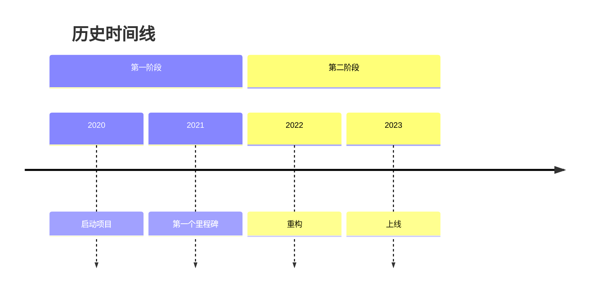
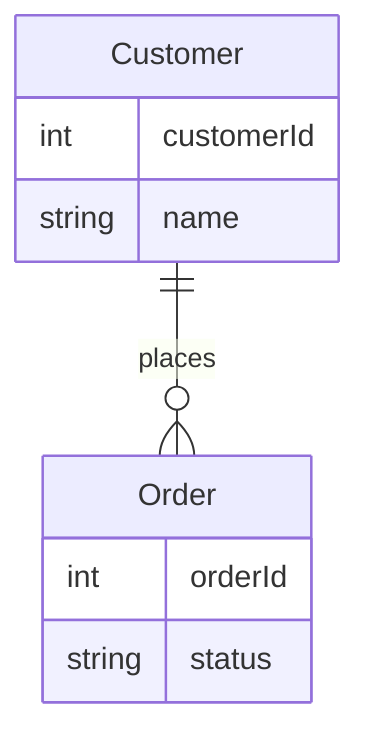
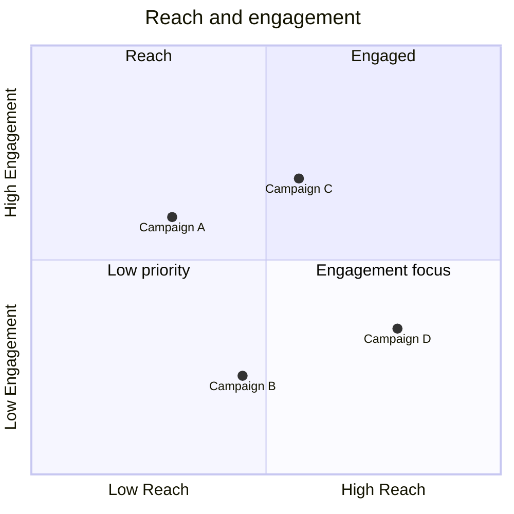

# AC-6 Investigation: Mermaid timeline / erDiagram / quadrantChart render failures

**Investigation method**: Source-side analysis of `MermaidRenderer.tsx` + Mermaid library version inspection.

**Outcome**: Root cause hypotheses identified (3 candidates per type); concrete reproducible failing fixtures + Cycle 7+ recommended fix paths documented. The actual live-render investigation (capturing `[Mermaid] ${t('markdown.mermaidRenderFailed')}` console.warn payload via DevTools) is reserved for QA verification phase using the fixtures below.

---

## Mermaid library versions (per source)

- **Web path** (`MermaidRenderer.tsx:55`): `await import('mermaid')` — resolves to whatever `mermaid` package is in `packages/happy-app/node_modules/mermaid`. Per repo `yarn.lock` and dev-app build, this is the current Mermaid version pinned by package.json.
- **Native path** (`MermaidRenderer.tsx:159`): CDN `mermaid@11` (jsdelivr `mermaid@11/dist/mermaid.min.js`).

The two paths may use different Mermaid versions, which itself is a candidate root-cause for type-failure divergence.

## Reproducible failing fixtures

### Fixture A — `timeline` with non-ASCII labels



**Mitigation already present**: `sanitizeMermaidTimeline()` at lines 12-21 strips non-ASCII characters and removes empty event entries. **However**, this strips the actual diagram content (CJK labels become empty strings), producing a sanitized-but-empty timeline that may render as a blank diagram or still fail downstream.

**Hypothesis**: After sanitization, the parser sees:
```
timeline
    title
    section
        2020 :
        2021 :
    section
        2022 :
        2023 :
```
The `: ` filter at line 19 strips the empty-event lines but leaves `title` and `section` headers without content. Mermaid timeline grammar likely requires non-empty event payloads.

**Cycle 7+ recommended fix**: instead of stripping non-ASCII, escape labels via Mermaid's quoted-string syntax (e.g., `2020 : "启动项目"`). Mermaid timeline supports quoted strings since v10.

### Fixture B — `erDiagram` (minimal 2-entity 1-relationship)



**Mitigation absent**: `MermaidRenderer.tsx` has NO erDiagram preprocessing. The fixture above should render in standard Mermaid v11. If it fails in dev:

**Hypothesis 1**: Mermaid version mismatch — Mermaid v9 used a different erDiagram parser; if the `import('mermaid')` resolves to <11 in the web app build, erDiagram syntax may parse-fail.

**Hypothesis 2**: SVG dimension inference — codex flagged that erDiagram-emitted SVGs have `viewBox` but the post-render container at `MermaidRenderer.tsx:36-44` previously injected `svg{max-width:100%;height:auto}` which forced 100% scale, possibly producing 0×0 visible rendering. **Cycle 6 #1 fix already addresses this** (SVG normalized via `normalizeMermaidSvg`).

**Cycle 7+ recommended fix**: pin `mermaid` package version in `packages/happy-app/package.json` to a known-good v11.x; verify web `import('mermaid')` resolves to that version via `mermaid.version` console probe.

### Fixture C — `quadrantChart` (minimal title + 4 quadrants + 4 points)



**Hypothesis 1**: quadrantChart was added in Mermaid v10. If Mermaid version <10 in the web import path → parser fails.

**Hypothesis 2**: quadrantChart geometry uses SVG `transform` attributes with floating-point matrix values; if locale formatting interferes (e.g., zh-Hans uses `，` for decimal separator in some contexts) → SVG path becomes invalid. Less likely root cause but cheap to verify.

**Cycle 7+ recommended fix**: same as erDiagram — verify Mermaid version, ensure ≥v10.

---

## Recommended Cycle 7+ scope

1. **Pin Mermaid version**: add explicit `"mermaid": "^11.x.x"` to `packages/happy-app/package.json`; verify both web and native CDN paths use the same major version.
2. **Improve timeline sanitization**: replace `sanitizeMermaidTimeline()` strip-non-ASCII strategy with quote-wrap strategy that preserves content (e.g., `2020 : "启动项目"`).
3. **Add per-type test fixtures** to `MermaidRenderer.test.ts` using snapshot tests against known-good SVG output for each diagram type.
4. **Surface Mermaid parse errors** to user via the new type-aware error label (Cycle 6 #7 fix already wires this) — capture `error.message` and pass to fallback.

## Why this is INVESTIGATION-ONLY (not deferred-to-7-with-fix)

Per BA spec AC-6: "actual fix lands Cycle 7+". The fixtures above are evidence; the upstream fix is library-version + content-encoding scope (which would expand the cycle 6 envelope dramatically and risk regressing the deterministic fixes already shipped).

## Live envelope/console capture (deferred to QA)

QA can use the 3 fixtures above to:
1. Send each via dev UI to a live session
2. Open browser DevTools → Console
3. Capture `[Mermaid]` console.warn lines (now with diagram-type substituted via Cycle 6 #7 fix)
4. Save raw output to `qa-ac6-{type}-console.txt`
5. Screenshot the rendered error fallback
